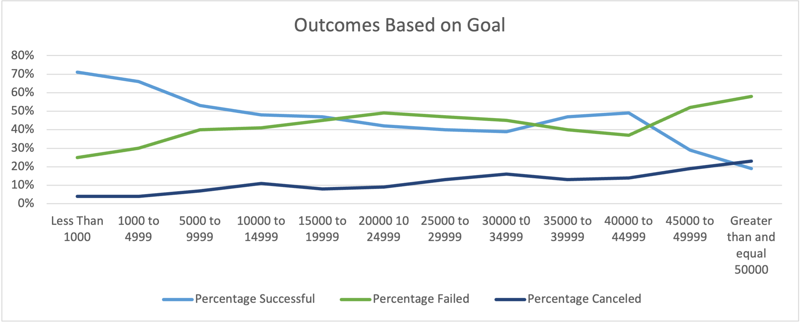
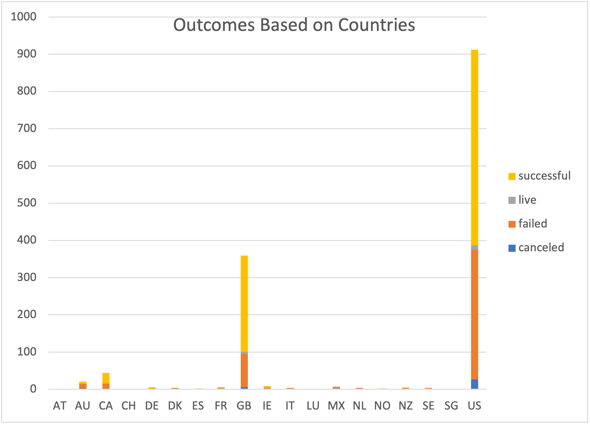

# Kickstarting with Excel

## Overview of Project
Lousie wants to start a crowdfunding campaign to help found her play,Fever. She want get at least $10,000 budget. We will help her get a greater understanding of campaigns and compare with other successful ones in Theater.
### Purpose
In this analysis, we will see Theater outcomes by different launch dates and outcomes by different goals range to find out  what dates are easy to succeed in a Theater and how many goals are the most reasonable to succeed.
## Analysis and Challenges

### Analysis of Outcomes Based on Launch Date
![Theater_Outcomes_vs_Launch]Resources/Theater_Outcomes_vs_Launch.png
According to above graph, the number of successfull outcomes incresaes from Jan (56) and become to top in May(111) and June(100). Then, it drop rapidly until it is almost the same as the number of failed outcomes. The number of failed outcomes has been fluctuating throughout the year between 30s to 50s. The number of cancelled are almost lower than 5 every month. 
### Analysis of Outcomes Based on Goals

Above the graph, the line of pecentage successful has over 70% (Top) at budget less than $1,000. Then it strarts to fall as the increasing amount of the goal. In the range between $1,000 to $39,999, the line fludtates around 50%. The line of failed one is completly opposite to line of successful. The average of percentage cancelled is 10%.
### Challenges and Difficulties Encountered
The most challenging thing is how to classify the Pivot table fields, I don't know what and why I need to put in fliter, rows and columns. First, I follow the guide of the modules to get right answer. Then, I will compare results of different rows,colums and filter. For example, I change the column-month to year or quarter to find what is difference. The results are not as clear as monthly. Also, I exchange the column and row, and the line become 12 lines, which is hard to make analysis. After I did these tests, I am clear to know when we choose the filters, columns and rows, we must figure out the relationship of them and how to show it clearly.   
## Results
### Two Conclusions of the Outcomes based on Launch Date
1. May and June are best time to start your kickstart, beacause the number of successfull outcomes reaches top in May(111) and June(100).
2. Don't hold your kickstart on Oct, which the failed cases reaches to the top (50).
### The Conclusion about the Outcomes based on Goals?
The best successful goal range for you is $5,000 to $39,999, which is around 50%. You can get higher percentage (max to 70%), if you must decrease your budget to less than $5,000
### The limitations of this Dataset
This Dataset is only for GB and US. Below the graph shows the kickstart, outcomes in GB and US is over 90% of totol. 

### Other Tables that we can be Created are also valuable
1. Outcome based on Countries - we can find which countries are easy to succeed.
2. Outcome based on the range from Launched date to Deadline - we can find how long to close a kickstart is most reasonable to succeed.

